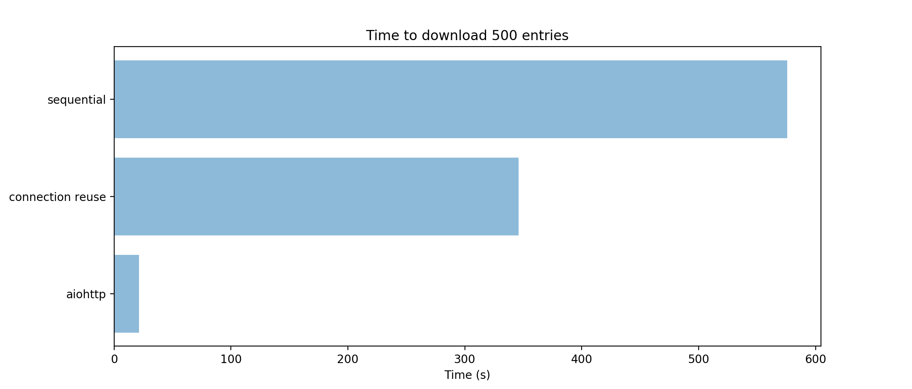

# Slackmoji Swarm

Mass downloader of Slack emoji.

#### Features
- Scrape a pre-retrieved `/customize/emoji` page to get names and URLs.
- Mass download them to a folder (with connection reuse! now proven by Performance Tests™️).

#### Usage
- Visit `https://<subdomain>.slack.com/customize/emoji` in your browser and save the HTML. This saves the script from authenticating.
- Update `in_file` in `config.py` to point to the saved HTML.
- Run `scrape.py` to see beautiful asynchronous download.

- If you want to upload to another Slack team, this output is compatible with [slack-emojinator](https://github.com/smashwilson/slack-emojinator).

#### Profiling
It's got a lot faster over time and now uses [aiohttp](http://aiohttp.readthedocs.io) for asynchronous HTTP connections.

The "sequential" download is the naive solution with `requests`, and the `connection reuse` is that plus SSL connection reuse.

#### FAQ

**Is this recent?**: The format parsed was defined 13-Oct-2017. Slack may have changed their `/customize/emoji` page since then.

**What about rate-limiting?**: Haven't run into any, even repeatedly downloading 900 emoji.
